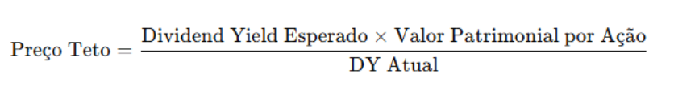

# Teste Desenvolvedor Python

Neste teste serão avaliados seus conhecimentos e a metodologia aplicada no desenvolvimento de uma aplicação .PYTHON.

## O Desafio

O desafio é criar um servidor que provê uma API RestFUL com o objetivo de fornecer informações sobre carteira de ativos de usuários cadastrados, como o preço-teto (modelo de Bazin) e, se estiver abaixo do preço atual, sugerir ou não a compra do ativo.

## Requisitos

Esses requisitos são obrigatórios e devem ser desenvolvidos para a entrega do teste.

### CRUD

Implementar as operações de **criação (POST)**, **consulta (GET)** (Por ID e GetAll), **atualização (PUT)** e **exclusão (DELETE)** de todas as entidades do seguinte diagrama:

Criar um modelo para listar os ativos (ações e FIIs), com campos como:
- Ticker (ex: PETR4.SA, HGLG11.SA, PORD11.SA)
- Nome do ativo
- Tipo (Ação ou FII)
- Dividend Yield (DY)
- Preço atual
- P/VP (Preço/Valor Patrimonial)
- Preço-Teto (modelo Bazin)
- Indicação (🟢 comprar ou 🔴 não-comprar)
- Outros campos relevantes para o cálculo do preço-teto.

Fórmula de Cálculo do Preço-Teto:

### Métodos

Após implementar o CRUD para as entidades, implemente os seguintes métodos:

* `Ativos por ID`: Implementar um método que recebe um ID como parâmetro e retorna TODAS as carteiras de ativos do usuário.

* `Ativos por Carteira`: Recebe o identificador de uma carteira e retorna os ativos associados a essa carteira.

* `Preço-Teto`: Recebe o identificador de um ativo, não necessariamente cadastrado na carteira do usuário, e retorna informações deste ativo, em especial o preço-teto pelo modelo de Bazin.

## O que é permitido

* Linguagem Python

* Django

* SQLite, PostgreSQL, MySQL, Oracle, etc.

* Quaisquer outras tecnologias complementares às citadas anteriormente são permitidas desde que seu uso seja justificável.

* Pode ser realizado em equipe desde que na entrega conste o nome de todos os participantes e um relatório das atividades.

## O que não é permitido

* Bancos de Dados **não relacionais**.
  
* Outras linguagens diferentes de Python.

## Recomendações

* O teste é propositalmente simples para permitir que você demonstre suas habilidades e conhecimentos sem escrever muito código. Sendo assim, é interessante utilizar design patterns e padrões de arquitetura.
* **Linter**: Desenvolva o projeto utilizando um padrão de formatação de código.

## Extras

Aqui são listadas algumas sugestões para você que quer ir além do desafio inicial. Lembrando que você não precisa se limitar a essas sugestões; se tiver pensado em outra funcionalidade que considera relevante ao escopo da aplicação, fique à vontade para implementá-la.

* **Documentação**: Gerar a documentação da API de forma automatizada, utilizando, por exemplo, `swagger` ou equivalentes como o `postman`.

* **Containerização**: Realizar a containerização da aplicação utilizando Docker.

* **Front-end da aplicação**: Desenvolver um front-end para a aplicação, seja em tecnologia .NET (MVC, Razor, Blazor) ou JavaScript (Django, Angular, ReactJS, VueJS, etc.)

## Entregas

Para realizar a entrega do teste você deve:

* Realizar o fork e clonar este repositório para sua máquina.
  
* Criar uma branch com o nome de `teste/[SEU NOME]`
  * `[SEU NOME]`: Seu nome
  * Exemplo: `teste/fulano-da-silva`;
  
* Fazer um commit da sua branch com a implementação do teste.
  
* Realizar o pull request da sua branch neste repositório.

Além do pull request, você deve **gravar um vídeo de no máximo 30 minutos** mostrando o que foi desenvolvido, falando sobre as decisões que foram tomadas, as tecnologias utilizadas, arquitetura e tudo que você achar relevante. A facecam é opcional, mas é um extra desejável. Esse vídeo deve ser postado no YouTube (pode ser não listado) e seu link deve estar no `README.md` do projeto.

## Dica

O `yfinance` é uma biblioteca do Python que permite acessar dados financeiros da API do Yahoo Finance. Com o `yfinance`, pode extrair informações atualizadas sobre ações, índices e muito mais, automatizando tarefas e agilizando a tomada de decisões no mercado financeiro. 
Veja: https://pypi.org/project/yfinance/

## Avaliação

Os projetos serão avaliados com base nos seguintes critérios:
- Implementação correta das funcionalidades requeridas.
- Organização e clareza do código.
- Uso adequado de boas práticas de programação e de Django.
- Criatividade na interface do usuário e funcionalidades extras.
- Não vale pontos, o objetivo é treinar.
